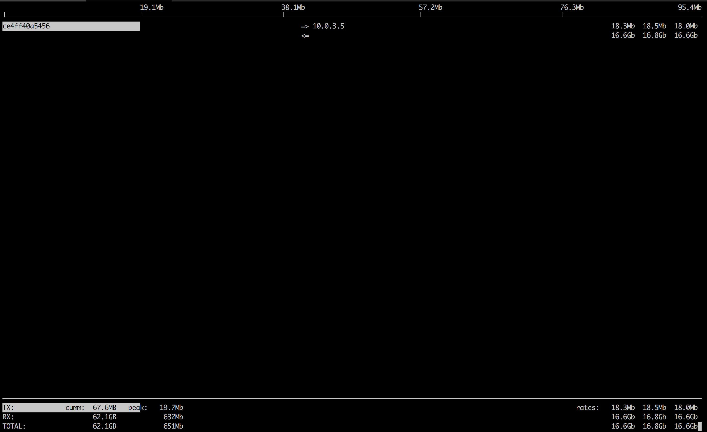
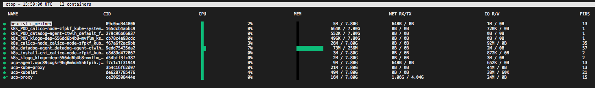

## netshoot: a Docker + Kubernetes network trouble-shooting swiss-army container

```
                    dP            dP                           dP
                    88            88                           88
88d888b. .d8888b. d8888P .d8888b. 88d888b. .d8888b. .d8888b. d8888P
88'  `88 88ooood8   88   Y8ooooo. 88'  `88 88'  `88 88'  `88   88
88    88 88.  ...   88         88 88    88 88.  .88 88.  .88   88
dP    dP `88888P'   dP   `88888P' dP    dP `88888P' `88888P'   dP
```

**Purpose:** Docker and Kubernetes network troubleshooting can become complex. With proper understanding of how Docker and Kubernetes networking works and the right set of tools, you can troubleshoot and resolve these networking issues. The `netshoot` container has a set of powerful networking tshooting tools that can be used to troubleshoot Docker networking issues. Along with these tools come a set of use-cases that show how this container can be used in real-world scenarios.

**Network Namespaces:** Before starting to use this tool, it's important to go over one key topic: **Network Namespaces**. Network namespaces provide isolation of the system resources associated with networking. Docker uses network and other type of namespaces (`pid`,`mount`,`user`..etc) to create an isolated environment for each container. Everything from interfaces, routes, and IPs is completely isolated within the network namespace of the container. 

Kubernetes also uses network namespaces. Kubelets creates a network namespace per pod where all containers in that pod share that same network namespace (eths,IP, tcp sockets...etc). This is a key difference between Docker containers and Kubernetes pods.

Cool thing about namespaces is that you can switch between them. You can enter a different container's network namespace, perform some troubleshooting on its network's stack with tools that aren't even installed on that container. Additionally, `netshoot` can be used to troubleshoot the host itself by using the host's network namespace. This allows you to perform any troubleshooting without installing any new packages directly on the host or your application's package. 

* **Container's Network Namespace:** If you're having networking issues with your application's container, you can launch `netshoot` with that container's network namespace like this :

`$ docker run -it --net container:<container_name> nicolaka/netshoot`

* **Host's Network Namespace:** If you think the networking issue is on the host itself, you can launch `netshoot` with that host's network namespace. This is how:
 
`$ docker run -it --net host nicolaka/netshoot`

* **Network's Network Namespace:** If you want to troubleshoot a Docker network, you can enter the network's namespace using `nsenter`. This is explained in the `nsenter` section below.

**Kubernetes:** If you want to spin up a throw away container for debugging.

`$ kubectl run --generator=run-pod/v1 tmp-shell --rm -i --tty --image nicolaka/netshoot -- /bin/bash`

And if you want to spin up a container on the host's network namespace.

`$ kubectl run tmp-shell --generator=run-pod/v1 --rm -i --tty --overrides='{"spec": {"hostNetwork": true}}'  --image nicolaka/netshoot  -- /bin/bash`

**Network Problems:** Many network issues could result in application performance degradation. Some of those issues could be related to the underlying networking infrastructure(underlay). Others could be related to misconfiguration at the host or Docker level. Let's take a look at common networking issues:

* latency
* routing 
* DNS resolution
* firewall 
* incomplete ARPs

To troubleshoot these issues, `netshoot` includes a set of powerful tools as recommended by this diagram. 


**Included Packages:** The following packages are included in `netshoot`. We'll go over some with some sample use-cases.

    apache2-utils
    bash
    bind-tools
    bird
    bridge-utils
    busybox-extras
    calicoctl
    conntrack-tools
    ctop
    curl
    dhcping
    drill
    ethtool
    file
    fping
    iftop
    iperf
    iproute2
    ipset
    iptables
    iptraf-ng
    iputils
    ipvsadm
    libc6-compat
    liboping
    mtr
    net-snmp-tools
    netcat-openbsd
    netgen
    nftables
    ngrep
    nmap
    nmap-nping
    openssl
    py-crypto
    py2-virtualenv
    python2
    scapy
    socat
    strace
    tcpdump
    tcptraceroute
    util-linux
    vim

##**Docker EE 2.0 + Kubernetes Use Cases:** 
Here's a list of use-cases that can help you understand when and how to use this container to solve networking issues in your Docker cluster. Please feel free to add your own use-case where you used `netshoot` to investigate, trouble-shoot, or just learn more about your environment!!!


## Managing Kubernetes Calico CNI with calicoctl

In Docker Enterprise Edition, and in so many Kubernetes-based solutions, [Calico](https://www.projectcalico.org/) is used as the default CNI plugin of choice. This means that all the pod networking related resources ( IP assignment, routing, network policies, etc..) is handled by Calico. [calicoctl](https://github.com/projectcalico/calicoctl) is a cli tool to makes it easy to manage Calico network and security policy, as well as other Calico configurations. The calicoctl tool talks directly to `etcd`, so it's often not possible or recommended to expose etcd outside of the Kubernetes cluster. A recommended way to use calicoctl is to run it on a the master node inside the cluster. 

Assuming you are running Docker EE 2.0 (although this should work on any Kuberenetes cluster with Calico installed), run the `netshoot` as a deployment using [this deployment](configs/netshoot-calico.yaml). This deployment will use the `kube-system` namespace.

```
# Note: This step assumes you loaded UCP client bundle and have kubectl working as expected.
🐳  → kubectl apply -f netshoot-calico.yaml
```

This deployment will deploy a single pod on a master node and automatically load up etcd certs so you can easily start using calicoctl. Now it's time to exec into the pod:

```
🐳  → kubectl get pod --selector=app=netshoot -n kube-system
NAME                                      READY     STATUS    RESTARTS   AGE
netshoot-calico-deploy-57b8896459-rzqz4   1/1       Running   0          1h
```

Now exec into this pod and use the calicoctl directly without any further configurations! Full documentations on using the calicoctl tool is found [here](https://docs.projectcalico.org/v3.1/reference/calicoctl/commands/).

```
🐳  → kubectl exec -it -n kube-system netshoot-calico-deploy-57b8896459-rzqz4 -- /bin/bash -l
                    dP            dP                           dP
                    88            88                           88
88d888b. .d8888b. d8888P .d8888b. 88d888b. .d8888b. .d8888b. d8888P
88'  `88 88ooood8   88   Y8ooooo. 88'  `88 88'  `88 88'  `88   88
88    88 88.  ...   88         88 88    88 88.  .88 88.  .88   88
dP    dP `88888P'   dP   `88888P' dP    dP `88888P' `88888P'   dP

Welcome to Netshoot! (github.com/nicolaka/netshoot)
root @ /
 [1] 🐳  → calicoctl get wep
WORKLOAD                            NODE              NETWORKS             INTERFACE
nginx-deployment-569477d6d8-98xv5   ip-10-56-14-210   192.168.134.207/32   calia756b40818a
netshoot-deploy-6bffc797bf-cfgpp    ip-10-56-17-161   192.168.63.80/32     cali50d3753ec26
nginx-deployment-569477d6d8-6klz6   ip-10-56-17-161   192.168.63.79/32     caliaef53a8ccae


root @ /
 [2] 🐳  → calicoctl get ippool
NAME                  CIDR
default-ipv4-ippool   192.168.0.0/16


root @ /
 [3] 🐳  → calicoctl get bgpconfig -o yaml
apiVersion: projectcalico.org/v3
items:
- apiVersion: projectcalico.org/v3
  kind: BGPConfiguration
  metadata:
    creationTimestamp: 2018-05-03T18:04:13Z
    name: default
    resourceVersion: "4519634"
    uid: 631aa7d6-4efc-11e8-92d5-06982eb5f90e
  spec:
    asNumber: 63400
    logSeverityScreen: Info
    nodeToNodeMeshEnabled: false
kind: BGPConfigurationList
metadata:
  resourceVersion: "6152496"
```

##**Docker + Swarm Use Cases:** 

## iperf 

Purpose : test networking performance between two containers/hosts. 

Create Overlay network:

```
$ docker network create -d overlay perf-test
```
Launch two containers:

```
🐳  → docker service create --name perf-test-a --network perf-test nicolaka/netshoot iperf -s -p 9999
7dkcckjs0g7b4eddv8e5ez9nv


🐳  → docker service create --name perf-test-b --network perf-test nicolaka/netshoot iperf -c perf-test-a -p 9999
2yb6fxls5ezfnav2z93lua8xl


 🐳  → docker service ls
ID            NAME         REPLICAS  IMAGE              COMMAND
2yb6fxls5ezf  perf-test-b  1/1       nicolaka/netshoot  iperf -c perf-test-a -p 9999
7dkcckjs0g7b  perf-test-a  1/1       nicolaka/netshoot  iperf -s -p 9999


🐳  → docker ps
CONTAINER ID        IMAGE                      COMMAND                  CREATED             STATUS              PORTS               NAMES
ce4ff40a5456        nicolaka/netshoot:latest   "iperf -s -p 9999"       31 seconds ago      Up 30 seconds                           perf-test-a.1.bil2mo8inj3r9nyrss1g15qav

🐳  → docker logs ce4ff40a5456
------------------------------------------------------------
Server listening on TCP port 9999
TCP window size: 85.3 KByte (default)
------------------------------------------------------------
[  4] local 10.0.3.3 port 9999 connected with 10.0.3.5 port 35102
[ ID] Interval       Transfer     Bandwidth
[  4]  0.0-10.0 sec  32.7 GBytes  28.1 Gbits/sec
[  5] local 10.0.3.3 port 9999 connected with 10.0.3.5 port 35112

```

## tcpdump

**tcpdump** is a powerful and common packet analyzer that runs under the command line. It allows the user to display TCP/IP and other packets being transmitted or received over an attached network interface. 

```
# Continuing on the iperf example. Let's launch netshoot with perf-test-a's container network namespace.

🐳  → docker run -it --net container:perf-test-a.1.0qlf1kaka0cq38gojf7wcatoa  nicolaka/netshoot 

# Capturing packets on eth0 and tcp port 9999.

/ # tcpdump -i eth0 port 9999 -c 1 -Xvv
tcpdump: listening on eth0, link-type EN10MB (Ethernet), capture size 262144 bytes
23:14:09.771825 IP (tos 0x0, ttl 64, id 60898, offset 0, flags [DF], proto TCP (6), length 64360)
    10.0.3.5.60032 > 0e2ccbf3d608.9999: Flags [.], cksum 0x1563 (incorrect -> 0x895d), seq 222376702:222441010, ack 3545090958, win 221, options [nop,nop,TS val 2488870 ecr 2488869], length 64308
	0x0000:  4500 fb68 ede2 4000 4006 37a5 0a00 0305  E..h..@.@.7.....
	0x0010:  0a00 0303 ea80 270f 0d41 32fe d34d cb8e  ......'..A2..M..
	0x0020:  8010 00dd 1563 0000 0101 080a 0025 fa26  .....c.......%.&
	0x0030:  0025 fa25 0000 0000 0000 0001 0000 270f  .%.%..........'.
	0x0040:  0000 0000 0000 0000 ffff d8f0 3435 3637  ............4567
	0x0050:  3839 3031 3233 3435 3637 3839 3031 3233  8901234567890123
	0x0060:  3435 3637 3839 3031 3233 3435 3637 3839  4567890123456789
	0x0070:  3031 3233 3435 3637 3839 3031 3233 3435  0123456789012345
	0x0080:  3637 3839 3031 3233 3435 3637 3839 3031  6789012345678901
	0x0090:  3233 3435 3637 3839 3031 3233 3435 3637  2345678901234567
	0x00a0:  3839 3031 3233 3435 3637 3839 3031 3233  8901234567890123
	0x00b0:  3435 3637 3839 3031 3233 3435 3637 3839  4567890123456789
	0x00c0:  3031 3233 3435 3637 3839 3031 3233 3435  0123456789012345
	0x00d0:  3637 3839 3031 3233 3435 3637 3839 3031  6789012345678901
	0x00e0:  3233 3435 3637 3839 3031 3233 3435 3637  2345678901234567
	0x00f0:  3839 3031 3233 3435 3637 3839 3031 3233  8901234567890123
	0x0100:  3435 3637 3839 3031 3233 3435 3637 3839  4567890123456789
	
```

More info on `tcpdump` can be found [here](http://www.tcpdump.org/tcpdump_man.html).


## netstat

Purpose: `netstat` is a useful tool for checking your network configuration and activity. 

Continuing on from `iperf` example. Let's use `netstat` to confirm that it's listening on port `9999`. 


```
🐳  → docker run -it --net container:perf-test-a.1.0qlf1kaka0cq38gojf7wcatoa  nicolaka/netshoot 

/ # netstat -tulpn
Active Internet connections (only servers)
Proto Recv-Q Send-Q Local Address           Foreign Address         State       PID/Program name
tcp        0      0 127.0.0.11:46727        0.0.0.0:*               LISTEN      -
tcp        0      0 0.0.0.0:9999            0.0.0.0:*               LISTEN      -
udp        0      0 127.0.0.11:39552        0.0.0.0:*                           -
```

##  nmap
`nmap` ("Network Mapper") is an open source tool for network exploration and security auditing. It is very useful for scanning to see which ports are open between a given set of hosts. This is a common thing to check for when installing Swarm or UCP because a range of ports is required for cluster communication. The command analyzes the connection pathway between the host where `nmap` is running and the given target address.

```
🐳  → docker run -it --privileged nicolaka/netshoot nmap -p 12376-12390 -dd 172.31.24.25

...
Discovered closed port 12388/tcp on 172.31.24.25
Discovered closed port 12379/tcp on 172.31.24.25
Discovered closed port 12389/tcp on 172.31.24.25
Discovered closed port 12376/tcp on 172.31.24.25
...
```
There are several states that ports will be discovered as:

- `open`: the pathway to the port is open and there is an application listening on this port.
- `closed`: the pathway to the port is open but there is no application listening on this port.
- `filtered`: the pathway to the port is closed, blocked by a firewall, routing rules, or host-based rules.


## iftop

Purpose: iftop does for network usage what top does for CPU usage. It listens to network traffic on a named interface and displays a table of current bandwidth usage by pairs of hosts.

Continuing the `iperf` example.

```
 → docker ps
CONTAINER ID        IMAGE                      COMMAND                  CREATED             STATUS              PORTS               NAMES
ce4ff40a5456        nicolaka/netshoot:latest   "iperf -s -p 9999"       5 minutes ago       Up 5 minutes                            perf-test-a.1.bil2mo8inj3r9nyrss1g15qav

🐳  → docker run -it --net container:perf-test-a.1.bil2mo8inj3r9nyrss1g15qav nicolaka/netshoot iftop -i eth0

```




## drill

Purpose: drill is a tool	to designed to get all sorts of information out of the DNS.

Continuing the `iperf` example, we'll use `drill` to understand how services' DNS is resolved in Docker. 


```
🐳  → docker run -it --net container:perf-test-a.1.bil2mo8inj3r9nyrss1g15qav nicolaka/netshoot drill -V 5 perf-test-b
;; ->>HEADER<<- opcode: QUERY, rcode: NOERROR, id: 0
;; flags: rd ; QUERY: 1, ANSWER: 0, AUTHORITY: 0, ADDITIONAL: 0
;; QUESTION SECTION:
;; perf-test-b.	IN	A

;; ANSWER SECTION:

;; AUTHORITY SECTION:

;; ADDITIONAL SECTION:

;; Query time: 0 msec
;; WHEN: Thu Aug 18 02:08:47 2016
;; MSG SIZE  rcvd: 0
;; ->>HEADER<<- opcode: QUERY, rcode: NOERROR, id: 52723
;; flags: qr rd ra ; QUERY: 1, ANSWER: 1, AUTHORITY: 0, ADDITIONAL: 0
;; QUESTION SECTION:
;; perf-test-b.	IN	A

;; ANSWER SECTION:
perf-test-b.	600	IN	A	10.0.3.4 <<<<<<<<<<<<<<<<<<<<<<<<<< Service VIP

;; AUTHORITY SECTION:

;; ADDITIONAL SECTION:

;; Query time: 1 msec
;; SERVER: 127.0.0.11 <<<<<<<<<<<<<<<<<<<<<<<<<<<<<<<<<<<<< Local resolver 
;; WHEN: Thu Aug 18 02:08:47 2016
;; MSG SIZE  rcvd: 56
```

## netcat

Purpose: a simple Unix utility that reads and writes data across network connections, using the TCP or UDP protocol. It's useful for testing and troubleshooting TCP/UDP connections. If there's a firewall rule blocking certain ports, `netcat` can be used to detect

```
🐳  →  docker network create -d overlay my-ovl
55rohpeerwqx8og4n0byr0ehu

🐳  → docker service create --name service-a --network my-ovl -p 8080:8080 nicolaka/netshoot nc -l 8080
bnj517hh4ylpf7ewawsp9unrc

🐳  → docker service create --name service-b --network my-ovl nicolaka/netshoot nc -vz service-a 8080
3xv1ukbd3kr03j4uybmmlp27j

🐳  → docker logs service-b.1.0c5wy4104aosovtl1z9oixiso
Connection to service-a 8080 port [tcp/http-alt] succeeded!

```
##  netgen
`netgen` is a simple [script](netgen.sh) that will generate a packet of data between containers periodically using `netcat`. It's purpose is to use the generated traffic to demonstrate different features of the networking stack.


`netgen <host> <ip>` will create a `netcat` server and client listening and sending to the same port.

Using `netgen` with `docker run`:

```
🐳  →  docker network create -d bridge br
01b167971453700cf0a40d7e1a0dc2b0021e024bbb119541cc8c1858343c9cfc

🐳  →  docker run -d --rm --net br --name c1 nicolaka/netshoot netgen c2 5000
8c51eb2100c35d14244dcecb80839c780999159985415a684258c7154ec6bd42

🐳  →  docker run -it --rm --net br --name c2 nicolaka/netshoot netgen c1 5000
Listener started on port 5000
Sending traffic to c1 on port 5000 every 10 seconds
Sent 1 messages to c1:5000
Sent 2 messages to c1:5000

🐳  →  sudo tcpdump -vvvn -i eth0 port 5000
...
```

Using `netgen` with `docker services`:

```
🐳  →  docker network create -d overlay ov
01b167971453700cf0a40d7e1a0dc2b0021e024bbb119541cc8c1858343c9cfc

🐳  →  docker service create --network ov --replicas 3 --name srvc netshoot netgen srvc 5000
y93t8mb9wgzsc27f7l2rdu5io

🐳  →  docker service logs srvc
srvc.1.vwklts5ybq5w@moby    | Listener started on port 5000
srvc.1.vwklts5ybq5w@moby    | Sending traffic to srvc on port 5000 every 10 seconds
srvc.1.vwklts5ybq5w@moby    | Sent 1 messages to srvc:5000
srvc.3.dv4er00inlxo@moby    | Listener started on port 5000
srvc.2.vu47gf0sdmje@moby    | Listener started on port 5000
...


🐳  →  sudo tcpdump -vvvn -i eth0 port 5000
...
```


##  iproute2

purpose: a collection of utilities for controlling TCP / IP networking and traffic control in Linux.

```
# Sample routing and arp table of the docker host.

🐳  → docker run -it --net host nicolaka/netshoot

/ # ip route show
default via 192.168.65.1 dev eth0  metric 204
172.17.0.0/16 dev docker0  proto kernel  scope link  src 172.17.0.1
172.19.0.0/16 dev br-fd694678f5c3  proto kernel  scope link  src 172.19.0.1 linkdown
172.20.0.0/16 dev docker_gwbridge  proto kernel  scope link  src 172.20.0.1
172.21.0.0/16 dev br-0d73cc4ac114  proto kernel  scope link  src 172.21.0.1 linkdown
172.22.0.0/16 dev br-1eb1f1e84df8  proto kernel  scope link  src 172.22.0.1 linkdown
172.23.0.0/16 dev br-aafed4ec941f  proto kernel  scope link  src 172.23.0.1 linkdown
192.168.65.0/29 dev eth0  proto kernel  scope link  src 192.168.65.2

/ # ip neigh show
192.168.65.1 dev eth0 lladdr f6:16:36:bc:f9:c6 STALE
172.17.0.7 dev docker0 lladdr 02:42:ac:11:00:07 STALE
172.17.0.6 dev docker0 lladdr 02:42:ac:11:00:06 STALE
172.17.0.5 dev docker0 lladdr 02:42:ac:11:00:05 STALE
```

More info on `iproute2` [here](http://lartc.org/howto/lartc.iproute2.tour.html)

## nsenter

Purpose: `nsenter` is a powerful tool allowing you to enter into any namespaces. `nsenter` is available inside `netshoot` but requires `netshoot` to be run as a privileged container. Additionally, you may want to mount the `/var/run/docker/netns` directory to be able to enter any network namespace including bridge and overlay networks. 


With `docker run --name container-B --net container:container-A `, docker uses `container-A`'s network namespace ( including interfaces and routes) when creating `container-B`. This approach is helpful for troubleshooting network issues at the container level. To troubleshoot network issues at the bridge or overlay network level, you need to enter the `namespace` of the network _itself_. `nsenter` allows you to do that. 

For example, if we wanted to check the L2 forwarding table for a overlay network. We need to enter the overlay network namespace and use same tools in `netshoot` to check these entries.  The following examples go over some use cases for using `nsenter` to understand what's happening within a docker network ( overlay in this case).

```
# Creating an overlay network
🐳  → docker network create -d overlay nsenter-test
9tp0f348donsdj75pktssd97b

# Launching a simple busybox service with 3 replicas
🐳  → docker service create --name nsenter-l2-table-test --replicas 3 --network nsenter-test busybox ping localhost
3692i3q3u8nephdco2c10ro4c

# Inspecting the service
🐳  → docker network inspect nsenter-test
[
    {
        "Name": "nsenter-test",
        "Id": "9tp0f348donsdj75pktssd97b",
        "Scope": "swarm",
        "Driver": "overlay",
        "EnableIPv6": false,
        "IPAM": {
            "Driver": "default",
            "Options": null,
            "Config": [
                {
                    "Subnet": "10.0.1.0/24",
                    "Gateway": "10.0.1.1"
                }
            ]
        },
        "Internal": false,
        "Containers": {
            "0ebe0fab555d2e2ef2fcda634bef2071ad3f5842b06bd134b40f259ab9be4f13": {
                "Name": "nsenter-l2-table-test.2.83uezc16jcaz2rp6cjwyf4605",
                "EndpointID": "3064946bb0224a4b3647cefcba18dcbea71b90a2ba1c09212a7bc599ec1ed3eb",
                "MacAddress": "02:42:0a:00:01:04",
                "IPv4Address": "10.0.1.4/24",
                "IPv6Address": ""
            },
            "55065360ac1c71638fdef50a073a661dec53b693409c5e09f8f854abc7dbb373": {
                "Name": "nsenter-l2-table-test.1.4ryh3wmmv21nsrfwmilanypqq",
                "EndpointID": "f81ae5f979d6c54f60636ca9bb2107d95ebf9a08f64786c549e87a66190f1b1f",
                "MacAddress": "02:42:0a:00:01:03",
                "IPv4Address": "10.0.1.3/24",
                "IPv6Address": ""
            },
            "57eca277749bb01a488f0e6c4e91dc6720b7c8f08531536377b29a972971f54b": {
                "Name": "nsenter-l2-table-test.3.9cuoq5m2ue1wi4lsw64k88tvz",
                "EndpointID": "ff1a251ffd6c674cd5fd117386d1a197ab68b4ed708187035d91ff5bd5fe0251",
                "MacAddress": "02:42:0a:00:01:05",
                "IPv4Address": "10.0.1.5/24",
                "IPv6Address": ""
            }
        },
        "Options": {
            "com.docker.network.driver.overlay.vxlanid_list": "260"
        },
        "Labels": {}
    }
]

# Launching netshoot in privileged mode
 🐳  → docker run -it --rm -v /var/run/docker/netns:/var/run/docker/netns --privileged=true nicolaka/netshoot
 
# Listing all docker-created network namespaces
 
 / # cd /var/run/docker/netns/
/var/run/docker/netns # ls
0b1b36d33313  1-9tp0f348do  14d1428c3962  645eb414b538  816b96054426  916dbaa7ea76  db9fd2d68a9b  e79049ce9994  f857b5c01ced
1-9r17dodsxt  1159c401b8d8  1a508036acc8  7ca29d89293c  83b743f2f087  aeed676a57a5  default       f22ffa5115a0


# The overlay network that we created had an id of 9tp0f348donsdj75pktssd97b. All overlay networks are named <number>-<id>. We can see it in the list as `1-9tp0f348do`. To enter it:

/ # nsenter --net=/var/run/docker/netns/1-9tp0f348do sh

# Now all the commands we issue are within that namespace. 

/ # ifconfig
br0       Link encap:Ethernet  HWaddr 02:15:B8:E7:DE:B3
          inet addr:10.0.1.1  Bcast:0.0.0.0  Mask:255.255.255.0
          inet6 addr: fe80::20ce:a5ff:fe63:437d%32621/64 Scope:Link
          UP BROADCAST RUNNING MULTICAST  MTU:1450  Metric:1
          RX packets:36 errors:0 dropped:0 overruns:0 frame:0
          TX packets:18 errors:0 dropped:0 overruns:0 carrier:0
          collisions:0 txqueuelen:0
          RX bytes:2224 (2.1 KiB)  TX bytes:1348 (1.3 KiB)

lo        Link encap:Local Loopback
          inet addr:127.0.0.1  Mask:255.0.0.0
          inet6 addr: ::1%32621/128 Scope:Host
          UP LOOPBACK RUNNING  MTU:65536  Metric:1
          RX packets:4 errors:0 dropped:0 overruns:0 frame:0
          TX packets:4 errors:0 dropped:0 overruns:0 carrier:0
          collisions:0 txqueuelen:1
          RX bytes:336 (336.0 B)  TX bytes:336 (336.0 B)

veth2     Link encap:Ethernet  HWaddr 02:15:B8:E7:DE:B3
          inet6 addr: fe80::15:b8ff:fee7:deb3%32621/64 Scope:Link
          UP BROADCAST RUNNING MULTICAST  MTU:1450  Metric:1
          RX packets:9 errors:0 dropped:0 overruns:0 frame:0
          TX packets:32 errors:0 dropped:0 overruns:0 carrier:0
          collisions:0 txqueuelen:0
          RX bytes:690 (690.0 B)  TX bytes:2460 (2.4 KiB)

veth3     Link encap:Ethernet  HWaddr 7E:55:C3:5C:C2:78
          inet6 addr: fe80::7c55:c3ff:fe5c:c278%32621/64 Scope:Link
          UP BROADCAST RUNNING MULTICAST  MTU:1450  Metric:1
          RX packets:13 errors:0 dropped:0 overruns:0 frame:0
          TX packets:26 errors:0 dropped:0 overruns:0 carrier:0
          collisions:0 txqueuelen:0
          RX bytes:970 (970.0 B)  TX bytes:1940 (1.8 KiB)

veth4     Link encap:Ethernet  HWaddr 72:95:AB:A1:6A:87
          inet6 addr: fe80::7095:abff:fea1:6a87%32621/64 Scope:Link
          UP BROADCAST RUNNING MULTICAST  MTU:1450  Metric:1
          RX packets:14 errors:0 dropped:0 overruns:0 frame:0
          TX packets:27 errors:0 dropped:0 overruns:0 carrier:0
          collisions:0 txqueuelen:0
          RX bytes:1068 (1.0 KiB)  TX bytes:2038 (1.9 KiB)

vxlan1    Link encap:Ethernet  HWaddr EA:EC:1D:B1:7D:D7
          inet6 addr: fe80::e8ec:1dff:feb1:7dd7%32621/64 Scope:Link
          UP BROADCAST RUNNING MULTICAST  MTU:1450  Metric:1
          RX packets:0 errors:0 dropped:0 overruns:0 frame:0
          TX packets:0 errors:0 dropped:33 overruns:0 carrier:0
          collisions:0 txqueuelen:0
          RX bytes:0 (0.0 B)  TX bytes:0 (0.0 B)

# Let's check out the L2 forwarding table. These MAC addresses belong to the tasks/containers in this service. 

/ # bridge  fdb show br br0
33:33:00:00:00:01 dev br0 self permanent
01:00:5e:00:00:01 dev br0 self permanent
33:33:ff:63:43:7d dev br0 self permanent
ea:ec:1d:b1:7d:d7 dev vxlan1 master br0 permanent
02:15:b8:e7:de:b3 dev veth2 master br0 permanent
33:33:00:00:00:01 dev veth2 self permanent
01:00:5e:00:00:01 dev veth2 self permanent
33:33:ff:e7:de:b3 dev veth2 self permanent
7e:55:c3:5c:c2:78 dev veth3 master br0 permanent
33:33:00:00:00:01 dev veth3 self permanent
01:00:5e:00:00:01 dev veth3 self permanent
33:33:ff:5c:c2:78 dev veth3 self permanent
72:95:ab:a1:6a:87 dev veth4 master br0 permanent
33:33:00:00:00:01 dev veth4 self permanent
01:00:5e:00:00:01 dev veth4 self permanent
33:33:ff:a1:6a:87 dev veth4 self permanent


# ARP and routing tables. Note that an overlay network only routes traffic for that network. It only has a single route that matches the subnet of that network.

/ # ip neigh show
/ # ip route
10.0.1.0/24 dev br0  proto kernel  scope link  src 10.0.1.1

# Looks like the arp table is flushed. Let's ping some of the containers on this network.

/ # ping 10.0.1.4
PING 10.0.1.4 (10.0.1.4) 56(84) bytes of data.
64 bytes from 10.0.1.4: icmp_seq=1 ttl=64 time=0.207 ms
64 bytes from 10.0.1.4: icmp_seq=2 ttl=64 time=0.087 ms
^C
--- 10.0.1.4 ping statistics ---
2 packets transmitted, 2 received, 0% packet loss, time 1002ms
rtt min/avg/max/mdev = 0.087/0.147/0.207/0.060 ms

/ # ip neigh show
10.0.1.4 dev br0 lladdr 02:42:0a:00:01:04 REACHABLE

# and using bridge-utils to show interfaces of the overlay network local bridge.

/ # brctl show
bridge name	bridge id		STP enabled	interfaces
br0		8000.0215b8e7deb3	no		vxlan1
							veth2
							veth3
							veth4
							
```

## CTOP
 ctop is a free open source, simple and cross-platform top-like command-line tool for monitoring container metrics in real-time. It allows you to get an overview of metrics concerning CPU, memory, network, I/O for multiple containers and also supports inspection of a specific container.

 # To get data into ctop, you'll need to bind docker.sock into the netshoot container.
```

/ # docker run -it --rm -v /var/run/docker.sock:/var/run/docker.sock nicolaka/netshoot ctop

```


It will display running and existed containers with useful metrics to help troubleshoot resource issues; hit "q" to exit.


## Feedback + Contribution

Feel free to provide feedback and contribute networking troubleshooting tools and use-cases by opening PRs.


 


